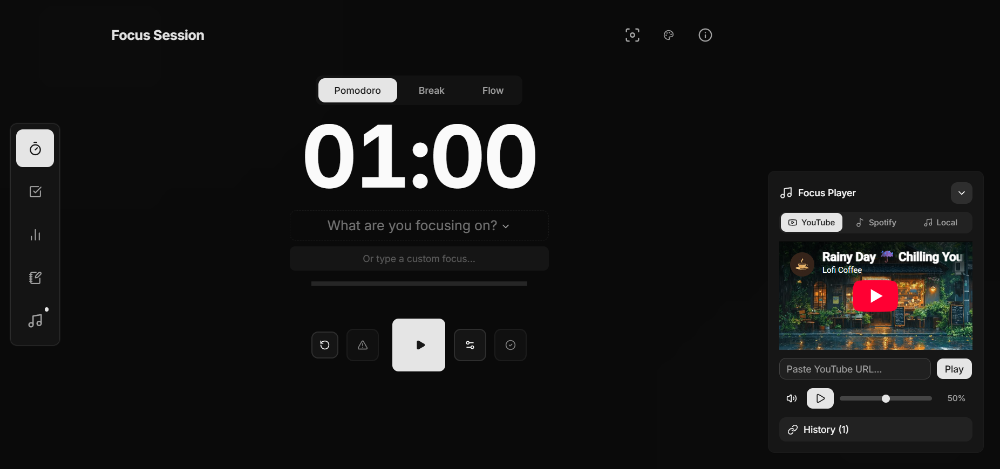
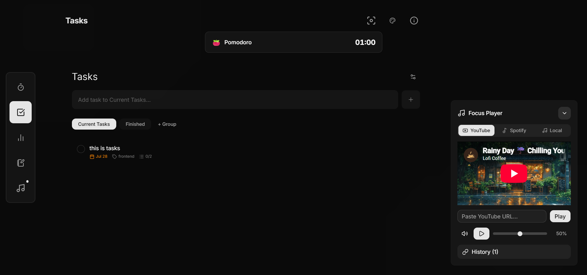
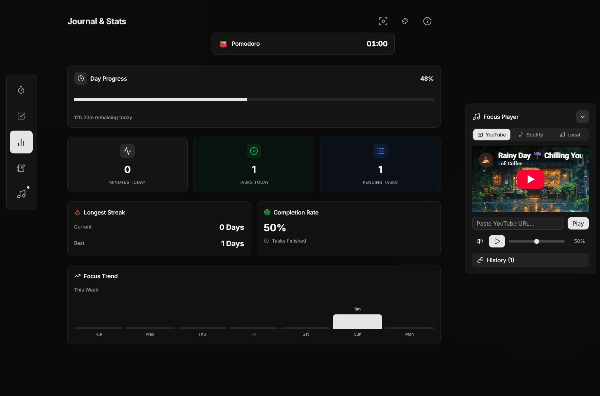

# 🎯 Focus

[](https://github.com/YogaDharma21/focus)
[](https://nextjs.org/)
[](https://reactjs.org/)
[](https://tailwindcss.com/)
[](https://www.typescriptlang.org/)
[](https://zustand-demo.pmnd.rs/)
[](https://opensource.org/licenses/MIT)

**Focus** is a modern, minimalist productivity web application designed to keep you in flow state. Featuring customizable Pomodoro and Flow timers, deep focus mode, automated break duration calculations, task management, distraction tracking, mood notes, and an ambient media player.



---

## ✨ Features

- **⏱️ Focus & Flow Timers**: Flexible Pomodoro and Flow (Stopwatch) modes.
- **🧮 Smart Flow Break Time**: Automatically calculates break duration as 1/5th of your Flow session length (e.g. 10 mins flow $\rightarrow$ 2 mins break).
- **🧘 Deep Focus Mode**: Distraction-free immersive view with custom session controls and keyboard shortcuts (`Esc` / `F`).
- **📝 Focus Session Custom Tasks**: Type custom focus goals directly into the timer and press `Enter` to instantly create and select new tasks.
- **✅ Task Management**: Organize tasks into groups, subtasks, estimated pomodoros, and recurring items.
- **📊 Stats & Productivity Trend**: Track daily focus minutes, completion rates, streak metrics, distraction breakdown, and weekly trend visualization.
- **💭 Mood & Notes**: Record your mood, thoughts, and reflections.
- **🎵 Ambient Media Player**: Background music player supporting YouTube playlists, Spotify embeds, and local focus tracks (auto-collapses on smaller screens).
- **🎨 Custom Backgrounds**: Dynamic backgrounds including dark gradients, mountain scenes, cozy cafes, and anime rooms.

---

## 📸 Gallery

<details open>
<summary>Click to toggle screenshots</summary>

### ⏱️ Focus Session


### ✅ Task Management


### 📊 Stats & Trend Analytics


### 💭 Mood & Notes


</details>

---

## 🛠️ Tech Stack

- **Framework**: [Next.js](https://nextjs.org/) (App Router), [React](https://reactjs.org/)
- **Language**: [TypeScript](https://www.typescriptlang.org/)
- **Styling**: [Tailwind CSS](https://tailwindcss.com/), [shadcn/ui](https://ui.shadcn.com/)
- **Icons**: [Lucide React](https://lucide.dev/)
- **State Management**: [Zustand](https://zustand-demo.pmnd.rs/) with Persistence
- **Utilities**: [date-fns](https://date-fns.org/)

---

## 🚀 Getting Started

### Prerequisites

- Node.js (v18+ recommended)
- npm / yarn / pnpm

### Installation

1. **Clone the repository:**

    ```bash
    git clone https://github.com/YogaDharma21/focus.git
    cd focus
    ```

2. **Install dependencies:**

    ```bash
    npm install
    ```

3. **Run the development server:**

    ```bash
    npm run dev
    ```

4. **Open your browser:**
   Navigate to [http://localhost:3000](http://localhost:3000) to start focusing.

---

## 📝 License

Distributed under the MIT License. See `LICENSE` for more information.
