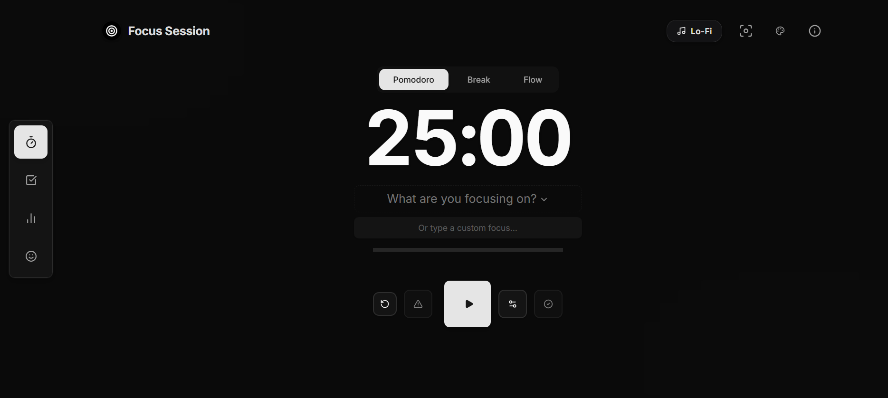
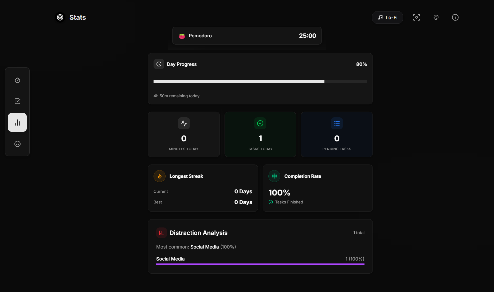
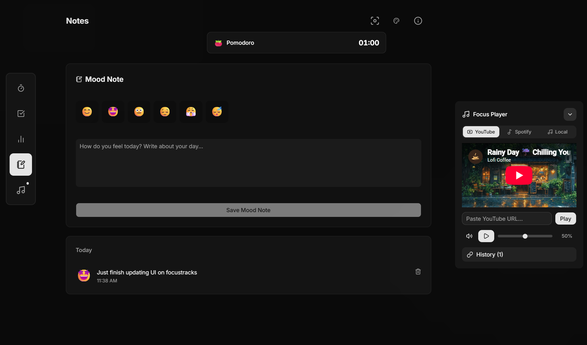
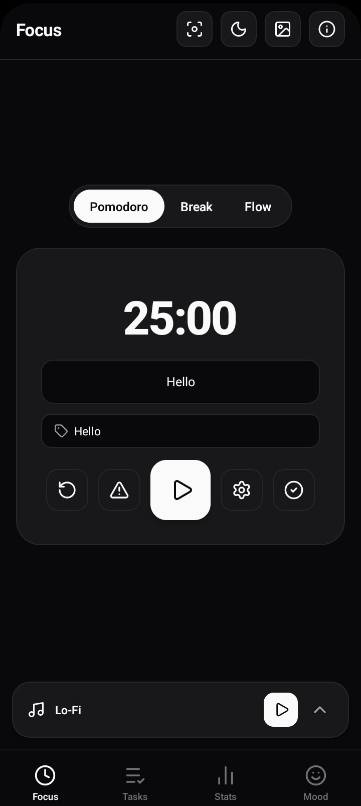
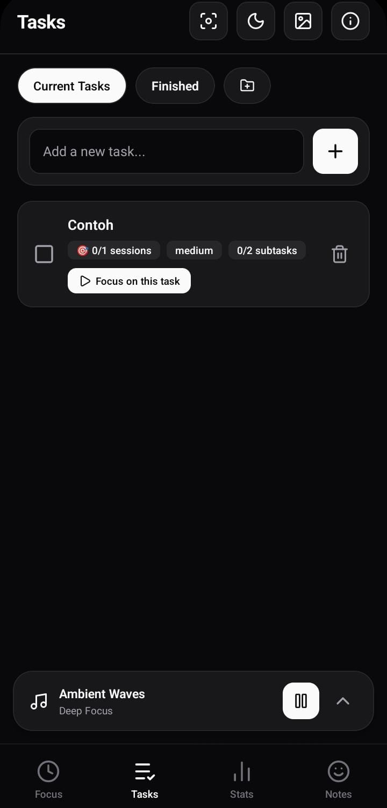
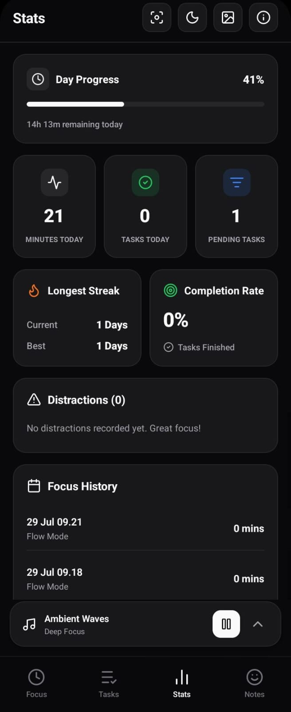
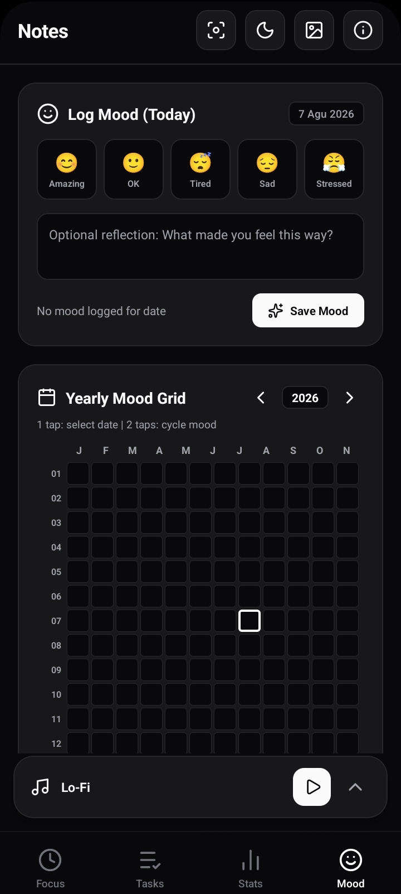

# Focus

[](https://github.com/YogaDharma21/focus)
[](https://nextjs.org/)
[](https://expo.dev/)
[](https://www.typescriptlang.org/)
[](https://opensource.org/licenses/MIT)

**Focus** is a modern, minimalist productivity suite designed to keep you in flow state. This monorepo houses the full ecosystem — from the Next.js web application with customizable timers, task management, and ambient media, to the mobile application, browser extension, backend services, CLI tools, and desktop client.

---

## Features

- **Focus & Flow Timers** — Flexible Pomodoro and Flow (Stopwatch) modes.
- **Smart Flow Break Calculation** — Automatically calculates break duration as 1/5th of your Flow session length (e.g. 10 mins flow -> 2 mins break).
- **Deep Focus Mode** — Distraction-free immersive view with session controls and keyboard shortcuts (`Esc` / `F`).
- **Focus Session Tasks** — Link sessions directly to tasks, with automatic task session completion and auto-finish logic.
- **Task Management** — Organize tasks into custom groups, subtasks, estimated sessions, priority levels, and recurring schedules.
- **Stats & Analytics** — Track daily focus minutes, task completion rates, streak metrics, distraction logs, and progress trends.
- **Mood & Notes** — Record daily mood logs and focus reflections.
- **Ambient Sound Player** — Background sound player supporting focus tracks and custom playlists.
- **Custom Backgrounds** — Dynamic themes including dark gradients, mountain scenes, cozy cafes, and anime rooms.

---

## Screenshots Gallery

<details>
<summary>View Web Application Screenshots</summary>

### Focus Session


### Task Management


### Stats & Analytics


### Mood & Notes


</details>

<details>
<summary>View Mobile Application Screenshots</summary>

| Focus & Flow Mode | Task Management | Stats & Analytics | Mood Notes |
| :---: | :---: | :---: | :---: |
|  |  |  |  |

</details>

<details>
<summary>View Browser Extension Screenshots</summary>

| Timer | Tasks | Site Blocking | Stats | Notes |
| :---: | :---: | :---: | :---: | :---: |
|  |  |  |  |  |

</details>

---

## Project Structure

This is a polyglot monorepo — each application is structured independently with its own dependencies and configuration.

```
focus/
├── apps/
│   ├── website/       🚧 Next.js web application (in development)
│   ├── mobile/        🚧 Expo / React Native mobile application (in development)
│   ├── extension/     🚧 Browser extension (in development)
│   ├── backend/       📦 Backend services (planned)
│   ├── cli/           📦 Command-line tools (planned)
│   └── desktop/       📦 Desktop application (planned)
│
├── docker/            Docker configurations
├── docs/              Architecture documentation
├── scripts/           Utility scripts
├── .github/           CI/CD workflows
├── LICENSE            MIT License
└── README.md          Root documentation
```

### Apps Overview

| App | Path | Status | Tech Stack |
|-----|------|--------|------------|
| **Website** | `apps/website/` | 🚧 In Development | Next.js, React, TypeScript, Tailwind CSS, Zustand |
| **Mobile** | `apps/mobile/` | 🚧 In Development | Expo SDK 52, React Native, TypeScript, Zustand |
| **Extension** | `apps/extension/` | 🚧 In Development | Vite, React, TypeScript, Tailwind CSS, Zustand, MV3 |
| **Backend** | `apps/backend/` | 📦 Planned | TBD |
| **CLI** | `apps/cli/` | 📦 Planned | TBD |
| **Desktop** | `apps/desktop/` | 📦 Planned | TBD |

---

## Getting Started

### Prerequisites

- Node.js (v18+ recommended)
- npm / yarn / pnpm

### Web Development Setup

```bash
cd apps/website
npm install
npm run dev
```

Open [http://localhost:3000](http://localhost:3000) in your browser.

### Mobile Development Setup

```bash
cd apps/mobile
npm install
npx expo start
```

Scan the QR code with Expo Go or run on Android Emulator / iOS Simulator.

### Extension Development Setup

```bash
cd apps/extension
npm install
npm run build
```

Then load the `apps/extension/dist` folder as an unpacked extension in `chrome://extensions/` (Developer mode enabled).

---

## License

Distributed under the MIT License. See `LICENSE` for details.
