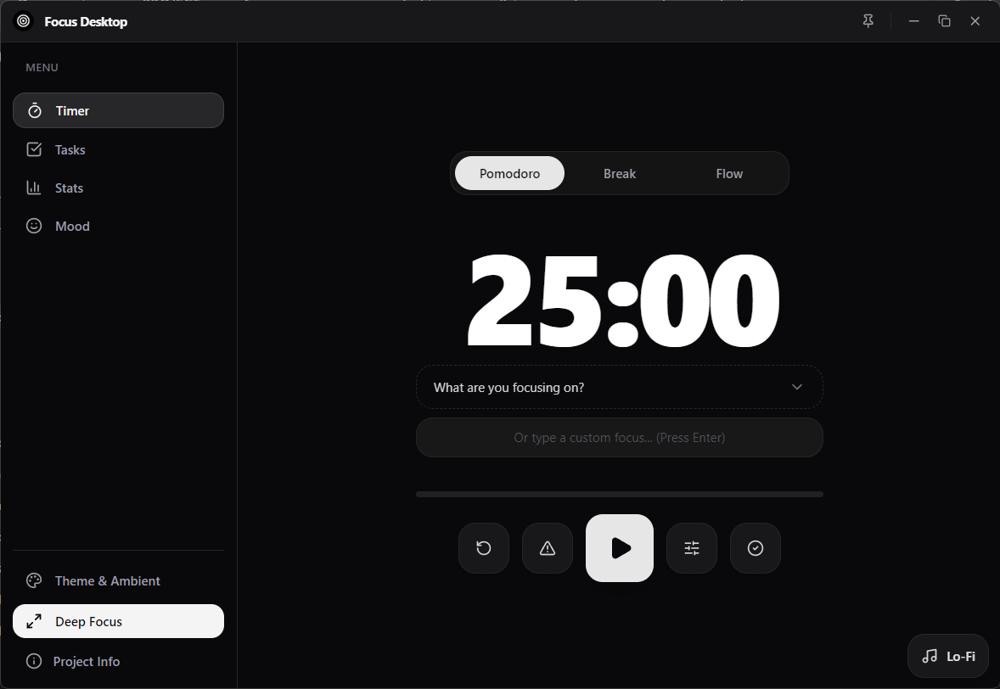
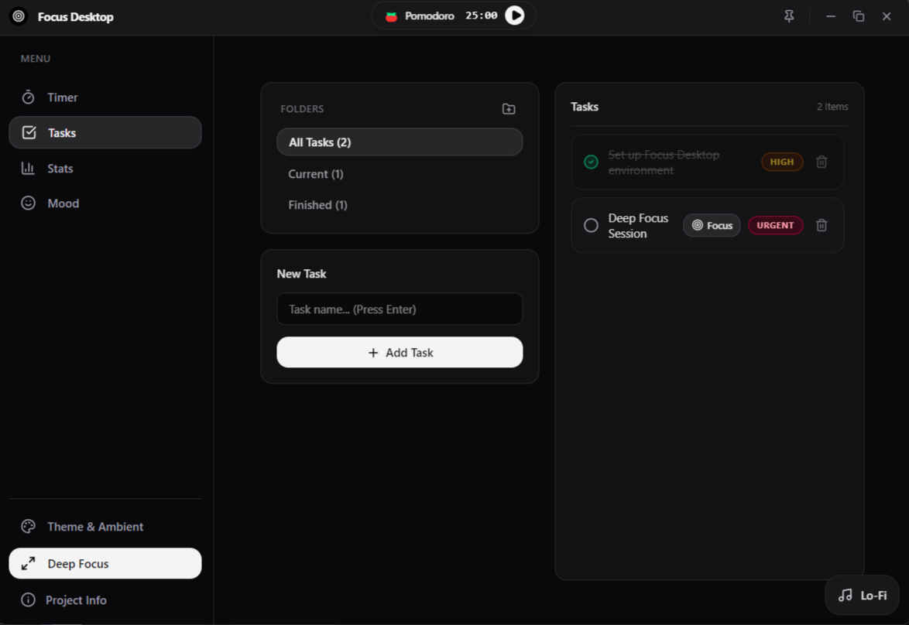
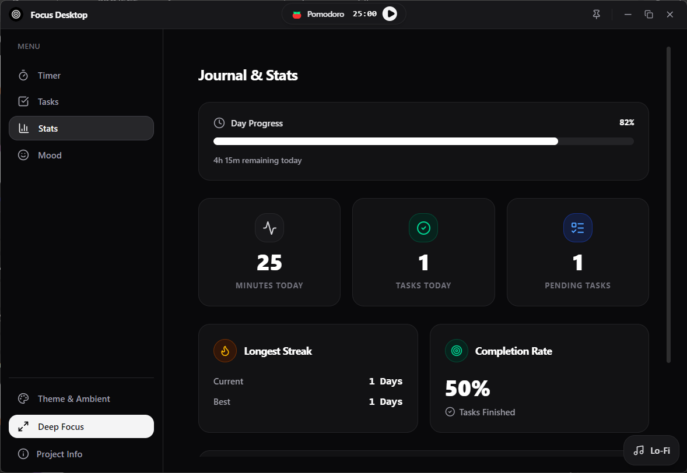
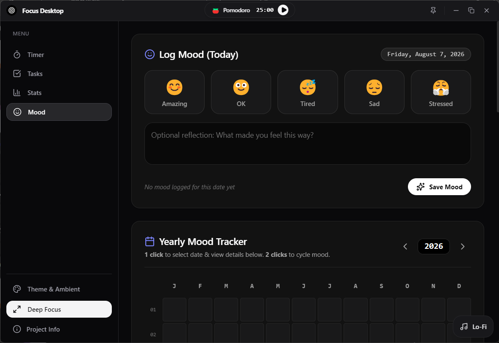

# Focus Desktop

[](https://github.com/YogaDharma21/focus)
[](https://www.electronjs.org/)
[](https://www.typescriptlang.org/)
[](https://react.dev/)
[](https://vitejs.dev/)
[]()

**Focus Desktop** is a modern, cross-platform Electron application for the Focus productivity suite. Built with Vite, React 19, TypeScript, and Tailwind CSS, it offers a desktop-native focus environment complete with a frameless custom window, compact floating timer capsule, customizable themes, task management, ambient sound player, mood tracking, and detailed session stats.

> This desktop client is part of the [Focus](../../README.md) monorepo and is currently **in active development**.

---

## Screenshots Gallery

<details>
<summary>View Desktop Application Screenshots</summary>

### Focus Session


### Task Management


### Stats & Analytics


### Mood & Notes


</details>

---

## Features

### Focus & Flow Timers
- **Pomodoro Mode** — Configurable focus & break durations with auto-start break features.
- **Flow Mode** — Open-ended stopwatch tracking with automatic break calculation (1/5th of flow duration).
- **Deep Focus Mode** — Immersive, distraction-free overlay with keyboard shortcuts (`Esc` / `F`).
- **Floating Timer Capsule** — Compact floating widget view for monitoring session progress outside the main app window.

### Task Management
- Create, manage, and complete tasks with priority levels (Low, Medium, High, Urgent).
- Organize tasks into custom groups/projects.
- Subtasks, due dates, estimated vs. completed pomodoro counts, and recurring task settings.
- Direct linkage between focus sessions and active tasks.

### Ambient Sound Player & Custom Backgrounds
- Built-in ambient background sounds and focus tracks.
- Dynamic theme selection including dark gradients, cozy cafes, mountain landscapes, and animated aesthetic scenes.

### Mood & Reflections
- Daily mood logger with custom status options.
- Free-form text notes and daily reflection journaling attached to mood logs.

### Stats & Analytics
- Live breakdown of total focus minutes, task completion count, and streak metrics.
- Detailed session logs and distraction tracking with timestamped logs.

### Native Desktop Experience
- Custom frameless title bar with native minimize, maximize, and close controls via IPC.
- System tray support and floating mini-widget overlay options.

---

## Architecture

```
apps/desktop/
├── electron/
│   ├── main.cjs               # Main process: IPC listeners, window creation, lifecycle
│   └── preload.cjs            # Preload script: Context bridge exposing window controls
├── public/
│   ├── Screenshot-*.png       # Application screenshots
│   ├── icon.png / icon.icns   # Desktop application icons
│   └── music1.mp3             # Preloaded ambient audio assets
├── src/
│   ├── components/
│   │   ├── layout/            # TitleBar, SidebarNav, FloatingTimerCapsule, GlobalTimerEngine
│   │   └── modules/           # FocusTimer, TodoList, StatsJournal, MoodTracker, DeepFocusOverlay
│   ├── lib/                   # Store, utilities, and helper modules
│   ├── App.tsx                # Main view router & overlay container
│   ├── main.tsx               # React application entry point
│   └── index.css              # Global styles & Tailwind directives
├── index.html                 # Main window HTML entry point
├── vite.config.ts             # Vite build & bundle configuration
├── tsconfig.json              # TypeScript configuration
└── package.json               # Dependencies and electron-builder config
```

---

## Tech Stack

| Category | Technology |
|----------|------------|
| Framework | Electron 34, React 19 |
| Language | TypeScript 5 |
| Styling | Tailwind CSS 4 |
| State Management | Zustand |
| Bundler | Vite 6 |
| Packaging | electron-builder |
| Icons | Lucide React |

---

## Getting Started

### Prerequisites

- Node.js (v18+ recommended)
- npm / yarn / pnpm

### Development Setup

1. **Install dependencies**:
   ```bash
   cd apps/desktop
   npm install
   ```

2. **Run dev server**:
   ```bash
   npm run dev
   ```
   This launches Vite in watch mode alongside Electron with hot module replacement (HMR).

### Building for Production

To compile TypeScript, bundle React assets with Vite, and generate the Windows installer via `electron-builder`:

```bash
npm run dist
```

Output binaries will be located in `apps/desktop/dist/release/`.

---

## License

Part of the Focus monorepo. Distributed under the MIT License. See the root [`LICENSE`](../../LICENSE) for details.
