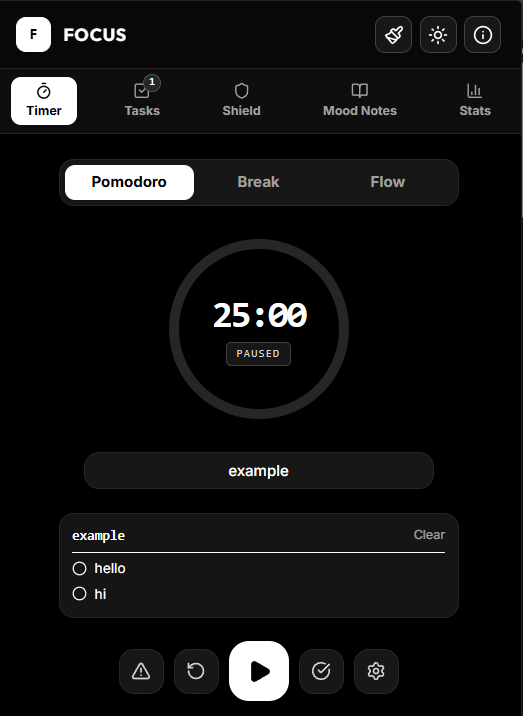
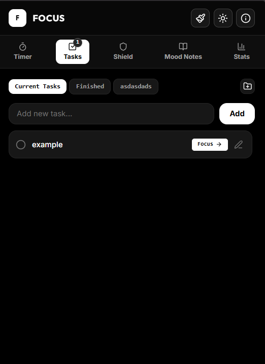
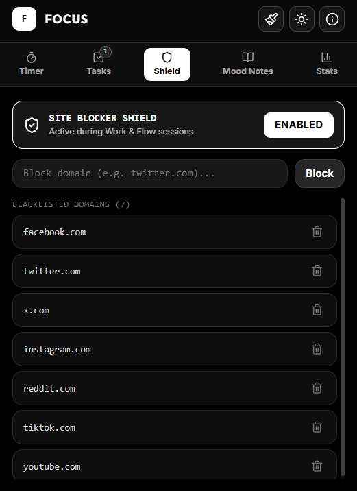
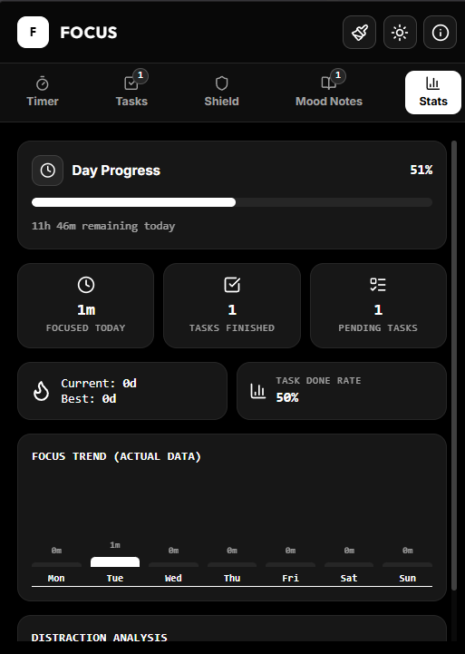
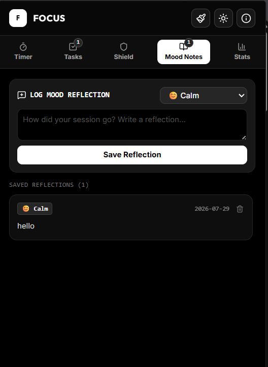

# Focus Extension

[](https://developer.chrome.com/docs/extensions/mv3/intro/)
[](https://www.typescriptlang.org/)
[](https://react.dev/)
[]()

**Focus Extension** is a monochrome-themed Chrome extension that brings the core Focus experience directly into your browser. It provides Pomodoro and Flow timers, task management, site blocking, mood journaling, and session analytics — all from a compact popup UI.

> This extension is part of the [Focus](../../README.md) monorepo and is currently **in active development**.

---

## Screenshots

| Timer | Tasks | Site Blocking | Stats | Notes |
| :---: | :---: | :---: | :---: | :---: |
|  |  |  |  |  |

---

## Features

### Timer
- **Pomodoro mode** — configurable work/break durations with auto-start break option.
- **Flow (Stopwatch) mode** — open-ended sessions that count up, with smart break calculation (1/5 of flow duration).
- Session naming and task linking for focused work tracking.
- Badge countdown — live timer displayed on the extension icon.

### Task Management
- Create, complete, and delete tasks with priority levels (low, medium, high, urgent).
- Organize tasks into custom groups.
- Subtasks, due dates, estimated/completed pomodoros, and recurring schedules.
- Task detail view with inline editing.

### Focus Shield (Site Blocking)
- Add distracting sites to a blocklist.
- Automatically redirects blocked sites to a custom "blocked" page during active work/flow sessions.
- Logs blocked attempts as distractions for later review.
- Real-time tab monitoring — blocks on navigation and tab switch.

### Notes and Mood
- Daily mood logging with preset mood options.
- Free-form text notes attached to each mood entry.

### Stats and Analytics
- Today's focus minutes and completed task count.
- Current and longest streak tracking.
- Weekly minutes breakdown by day.
- Session history with duration and mode.
- Distraction log with categories and timestamps.

### Appearance
- Dark and light theme toggle.
- Background pattern selector (solid, gradient, grid, stripes, crosshatch, dot matrix).

---

## Architecture

```
apps/extension/
├── public/
│   ├── manifest.json          # Chrome Extension manifest (MV3)
│   └── Screenshot-*.png       # Extension screenshots
├── src/
│   ├── background/
│   │   └── background.ts      # Service worker: timer logic, tab blocking, badge updates
│   ├── blocked/
│   │   ├── Blocked.tsx        # Blocked site redirect page
│   │   └── main.tsx           # Blocked page entry point
│   ├── content/
│   │   └── content.ts         # Content script injected into pages
│   ├── lib/
│   │   └── storage.ts         # Chrome storage wrapper (get/save/subscribe)
│   ├── popup/
│   │   ├── Popup.tsx          # Main popup UI (all tabs and features)
│   │   └── main.tsx           # Popup entry point
│   ├── types/
│   │   └── index.ts           # Shared TypeScript types
│   └── index.css              # Global styles
├── blocked.html               # Blocked page HTML shell
├── popup.html                 # Popup HTML shell
├── vite.config.ts             # Vite build configuration with multi-entry setup
├── tsconfig.json              # TypeScript configuration
└── package.json
```

### How It Works

1. **Popup** (`popup.html` + `Popup.tsx`) — The main interface users interact with. Contains tabbed navigation for timer, tasks, shield, notes, and stats. All state is persisted to `chrome.storage.local`.

2. **Background Service Worker** (`background.ts`) — Runs independently of the popup. Handles the timer countdown/countup, session transitions, badge updates, desktop notifications, and enforces site blocking by monitoring tab events.

3. **Content Script** (`content.ts`) — Injected into all pages at `document_start`. Works alongside the background script for page-level interactions.

4. **Blocked Page** (`blocked.html` + `Blocked.tsx`) — A full-page redirect shown when a user tries to visit a blocked site during an active focus session.

5. **Storage Layer** (`storage.ts`) — Wraps `chrome.storage.local` with typed get/save helpers and a `subscribeToStateChanges` listener for reactive UI updates.

---

## Tech Stack

| Category | Technology |
|----------|------------|
| Language | TypeScript 5 |
| UI | React 19, Lucide Icons |
| Styling | Tailwind CSS 4 |
| State | Zustand, Chrome Storage API |
| Build | Vite 6, `@vitejs/plugin-react` |
| API | Chrome Extensions Manifest V3 |
| Auth (planned) | Clerk (`@clerk/chrome-extension`) |
| Backend (planned) | Convex |

---

## Getting Started

### Prerequisites

- Node.js v18+
- npm
- A Chromium-based browser (Chrome, Edge, Brave, etc.)

### Install and Build

```bash
cd apps/extension
npm install
npm run build
```

### Load in Chrome

1. Open `chrome://extensions/` in your browser.
2. Enable **Developer mode** (top-right toggle).
3. Click **Load unpacked**.
4. Select the `apps/extension/dist` folder.
5. The Focus extension icon should appear in your toolbar.

### Development

```bash
npm run dev
```

After making changes, go to `chrome://extensions/` and click the reload button on the extension card.

---

## Permissions

The extension requests the following permissions (defined in `manifest.json`):

| Permission | Purpose |
|------------|---------|
| `storage` | Persist timer state, tasks, settings, and session data |
| `tabs` | Monitor and redirect blocked tabs during focus sessions |
| `notifications` | Desktop notifications when sessions complete |
| `alarms` | Scheduling support for timer operations |
| `activeTab` | Access to the currently active tab for shield enforcement |
| `<all_urls>` (host) | Required for content script injection and universal site blocking |

---

## Roadmap

- [ ] Clerk authentication integration
- [ ] Convex backend sync (cross-device state)
- [ ] Extension icon/assets
- [ ] Chrome Web Store publishing
- [ ] Firefox/Safari support

---

## License

Part of the Focus monorepo. Distributed under the MIT License. See the root [`LICENSE`](../../LICENSE) for details.
